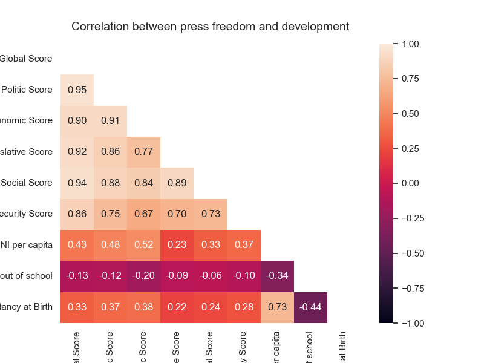

  <h3 align="center">The risk of telling the truth: an analysis of press freedom around the world</h3>

  <h6 align="center">
    Ironhack: project II

## Table of contents

- [Introduction](#introduction)
- [Data](#data)
    * [RSF](#1-reporters-without-borders)
    * [Data enriching](#data-enriching)
- [What is the link between press freedom and development?](#what-is-the-link-between-press-freedom-and-development)
    * [GNI per capita](#11-gni-per-capita)
    * [Life expectancy](#12-life-expectancy-at-birth)
    * [Education](#13-education)
- [Last remarks](#last-remarks)
- [References](#references)

## Introduction

In this project, I merged data from Reporters Without Borders and The World Bank to create a dataframe with indicators for press freedom and human development for 180 countries. 

## Data

#### 1. Reporters without borders

The data used for this analysis was obtained from the World Press Freedom Index for 2022 report made by **Reporters Without Borders (RSF)**, which assesses the state of journalism in 180 countries around the world. It measures the abuse journalists and media workers have to endure, and different contextual indicators that can make information inaccesible for citizens: political context, legal framework, economic context, sociocultural context and safety.

1. Norway tops the World Press Freedom Index 2022 with a score of 92.65, and is followed by Denmark and Sweden with global scores of 90.27 and 88.84 respectively. 

2. North Korea is the worst-ranked country in the world with a score of 13.92. Other countries in the bottom five are Myanmar, Turkmenistan, Iran, and Eritrea. 

3. The country with the biggest drop in the table was Hong Kong, and the one with the biggest raise was Timor Oriental.

The data also shows us the number of journalists and media workers that have been imprisoned or that have lost their lives while doing their job. In the next two maps we can see the number of journalists that have been imprisoned and killed in every country this year.

We can also divide the map into the situation each country is living. Going very serious to good. 

#### World Bank indicators

According to the UN, the development of each country depends on the income, health and education the country has. This can be measured with the Human Development Index that is composed by three variables: *GNI per capita, life expectancy at birth and mean years of schooling.*

To get these three variables I used the World Bank api that has information for every country and every year. The api doesn't require a token, and I just had to look for the indicator codes of the information I wanted to download. 

## What is the link between press freedom and development?

*“Press freedom and the free flow of information are necessary not only to inform citizens about the country's development goals, but to enable them to hold their leaders accountable for fulfilling the pledges they have made”*

#### 1.1 GNI per capita

This indicator provides per capita values for gross national income (GNI. Formerly GNP) expressed in current international dollars converted by purchasing power parity (PPP) conversion factor.

#### 1.2 Life expectancy at birth

Life expectancy at birth indicates the number of years a newborn infant would live if prevailing patterns of mortality at the time of its birth were to stay the same throughout its life.

#### 1.3 Education

Children out of school are the percentage of primary-school-age children who are not enrolled in primary or secondary school. 

   

## Last Remarks

 A free press always has a positive influence on poverty and on governance. It holds government accountable and makes their actions transparent and expands participations in the political decision making beyond a small inner circle.

### References

- https://www.sciencedirect.com/science/article/abs/pii/S0308597X13000055 
- https://seatemperatures.net/blog/scuba-diving-statistics-how-many-people-scuba-dive/#:~:text=Between%20November%202020%20and%20November,6%20million%20active%20scuba%20divers. 
- https://www.instagram.com/thelifeofsharks/